##

> Lingo is a responsive design based on the React library that allows users to subscribe to and access on-demand translations from multiple languages made by a translator.
>
> ~~Live demo [_here_]()~~. **Not currently available**

## Table of Contents
* [General Info](#general-information)
* [Technologies Used](#technologies-used)
* [Features](#features)
* [Screenshots](#screenshots)
* [Setup](#setup)
* [Usage](#usage)
* [Project Status](#project-status)
* [Room for Improvement](#room-for-improvement)
* [Acknowledgements](#acknowledgements)
* [Contact](#contact)
* [License](#license)

## General Information
- This project allows users to learn foreign languages through access to professional translations made by translators and also access to information about how to improve their language learning.
- The problem as Lingo is to solve is to simplify users' access to translators and also to give them knowledge on how they can develop their language skills. And all this in an accessible form.
- As a goal of this project is to create a platform for learning and connecting people by blurring the language barrier between them.
- The project is created to develop users' interpersonal communication and programming skills

## Technologies Used
- **@emotion/react** (version ^11.11.1) - A JavaScript library for building user interfaces.
- **@emotion/styled** (version ^11.11.0) - A JavaScript library for styling React components with JavaScript.
- **@fortawesome/fontawesome-svg-core** (version ^6.4.2) - Scalable vector icons library.
- **@fortawesome/free-brands-svg-icons** (version ^6.4.2) - Free brand icons from FontAwesome.
- **@fortawesome/free-solid-svg-icons** (version ^6.4.2) - Free solid icons from FontAwesome.
- **@fortawesome/react-fontawesome** (version ^0.2.0) - React component for FontAwesome icons.
- **@mui/icons-material** (version ^5.14.8) - Material-UI icons for React.
- **@mui/joy** (version ^5.0.0-beta.11) - The Joy of building Material-UI components.
- **@mui/material** (version ^5.14.8) - Material-UI components for React.
- **@testing-library/jest-dom** (version ^5.17.0) - Utilities for testing DOM elements with Jest.
- **@testing-library/react** (version ^13.4.0) - Utilities for testing React components with Jest.
- **@testing-library/user-event** (version ^13.5.0) - Utilities for simulating user events in testing.
- **axios** (version ^1.5.1) - Promise-based HTTP client for the browser and Node.js.
- **body-parser** (version ^1.20.2) - Middleware for parsing request bodies in Express.
- **bootstrap** (version ^5.3.1) - Front-end component library.
- **cors** (version ^2.8.5) - Middleware for handling Cross-Origin Resource Sharing.
- **dotenv** (version ^16.3.1) - Loads environment variables from a .env file.
- **express** (version ^4.18.2) - Web application framework for Node.js.
- **framer-motion** (version ^10.16.4) - Animation library for React.
- **mongodb** (version ^6.3.0) - NoSQL database.
- **mongoose** (version ^7.6.5) - MongoDB object modeling for Node.js.
- **nodemon** (version ^3.0.1) - Utility that monitors for changes and restarts the server.
- **prop-types** (version ^15.8.1) - Runtime type checking for React props.
- **react** (version ^18.2.0) - JavaScript library for building user interfaces.
- **react-bootstrap** (version ^2.8.0) - Bootstrap components built with React.
- **react-color** (version ^2.19.3) - Color picker component for React.
- **react-dom** (version ^18.2.0) - Entry point to the DOM and server renderers for React.
- **react-icons** (version ^4.11.0) - Icon library for React projects.
- **react-id-swiper** (version ^4.0.0) - Swiper/slider component for React.
- **react-intersection-observer** (version ^9.5.2) - Wrapper for the Intersection Observer API.
- **react-modal** (version ^3.16.1) - Modal dialog component for React.
- **react-paginate** (version ^8.2.0) - Pagination component for React.
- **react-quill** (version ^2.0.0) - React wrapper for the Quill rich text editor.
- **react-router-dom** (version ^6.15.0) - Routing library for React.
- **react-scripts** (version ^5.0.1) - Scripts and configuration used by Create React App for building React applications.
- **react-scroll** (version ^1.8.9) - Library for animating scrolling to specific elements.
- **react-scroll-motion** (version ^0.3.2) - Library for animating elements based on scroll position.
- **react-scrollama** (version ^2.3.2) - Library for creating scroll-driven interactions.
- **react-spring** (version ^9.7.2) - Spring-physics based animation library for React.
- **react-transition-group** (version ^4.4.5) - Library for managing component state transitions in React.
- **react-visibility-sensor** (version ^5.1.1) - Component to track the visibility of elements.
- **sass** (version ^1.66.1) - CSS extension language.
- **styled-components** (version ^6.0.7) - Library for styling React components with tagged template literals.
- **swiper (version ^10.2.0)** - Modern, mobile-friendly slider library.
- **web-vitals (version ^2.1.4)** - Library for measuring key performance metrics of a web page.

## Features
List the ready features:
- Dynamic slider created using the SwiperJS library.
- Animation system and their complementary action.
- Scrolling Section, which dynamically changes the content that the user sees on the page using animation, depending on their current position on the page.
- CRUD actions for posts and categories.
- Implementation of a rich text editor for post content and categories.
- Pagination in the form of load more.

More in development

## Screenshots
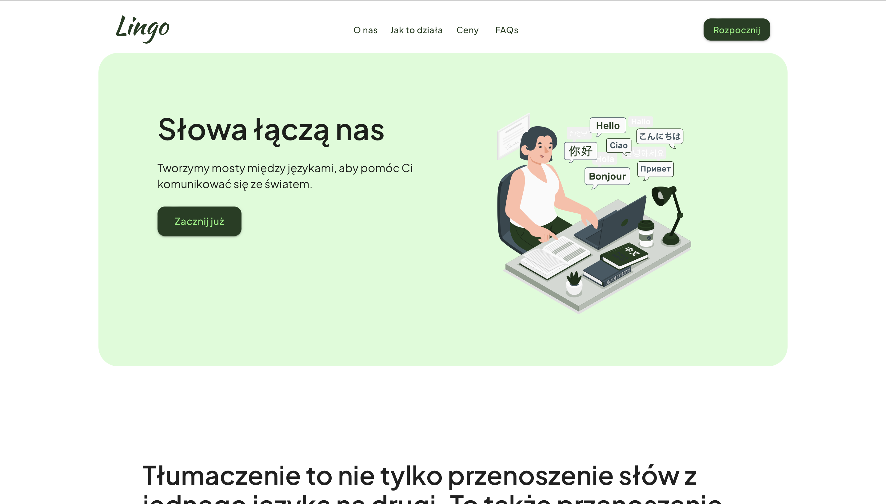
**Landing page**

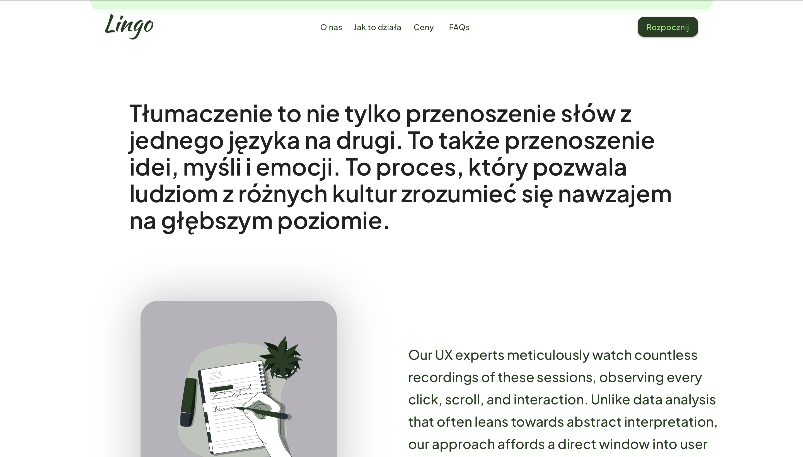
**About us**

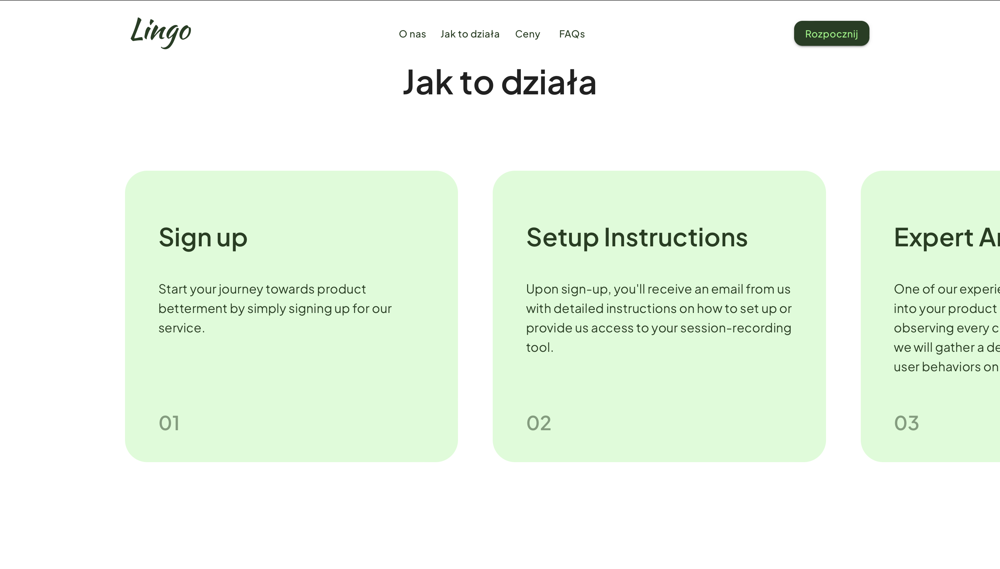
**How it works**

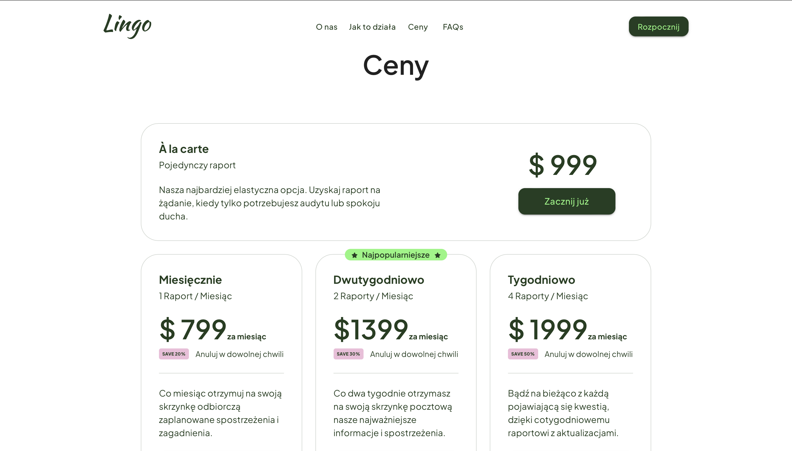
**Pricing**

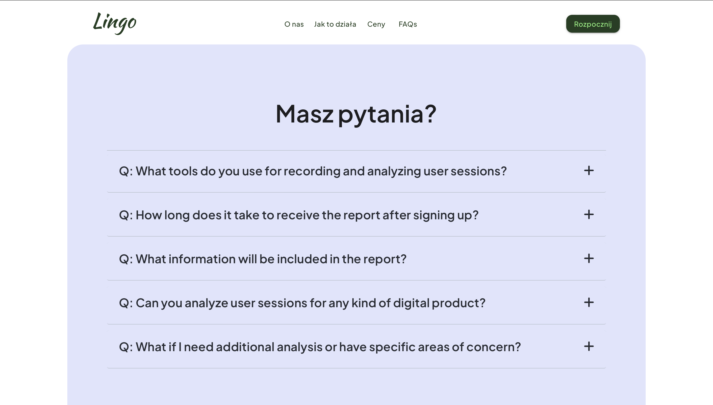
**FAQs**

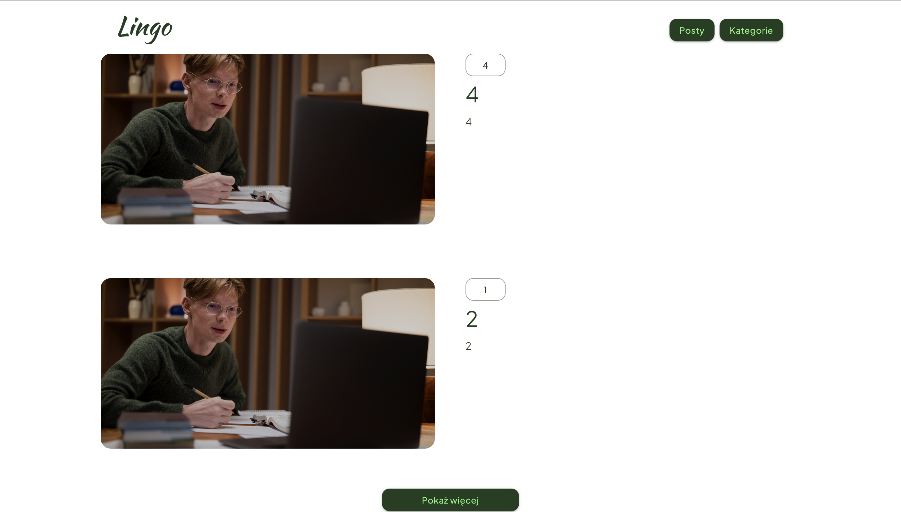
**Posts user page**

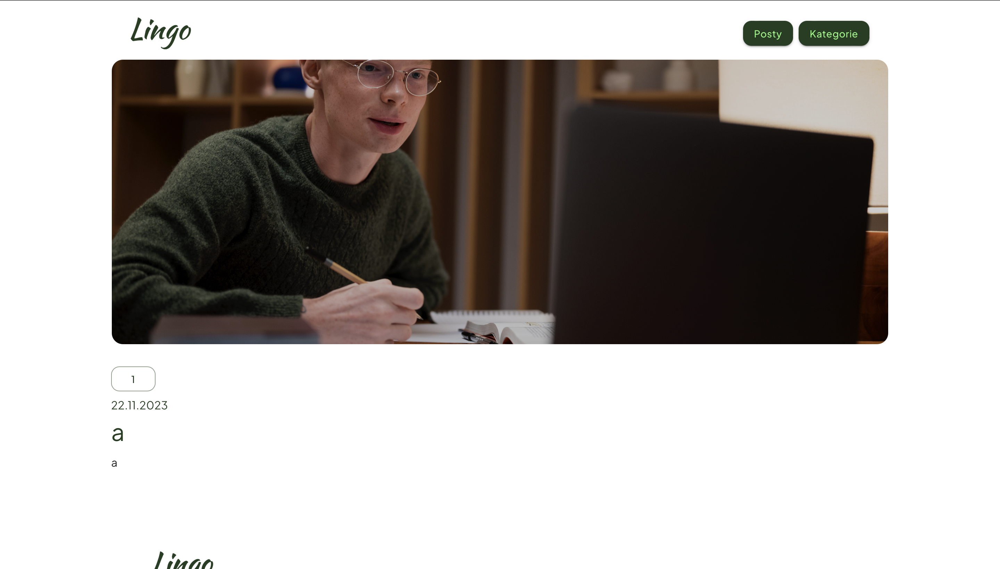
**Post page**

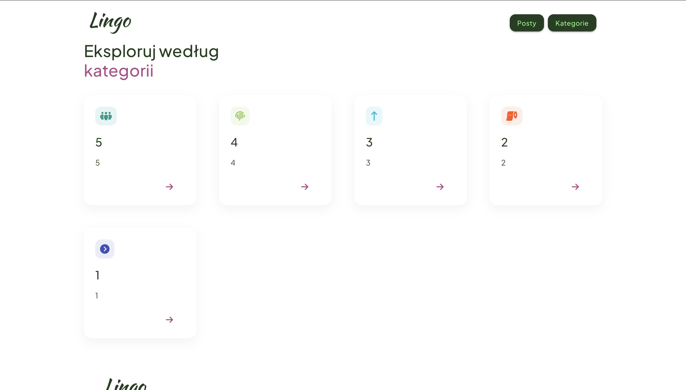
**Categories user page**

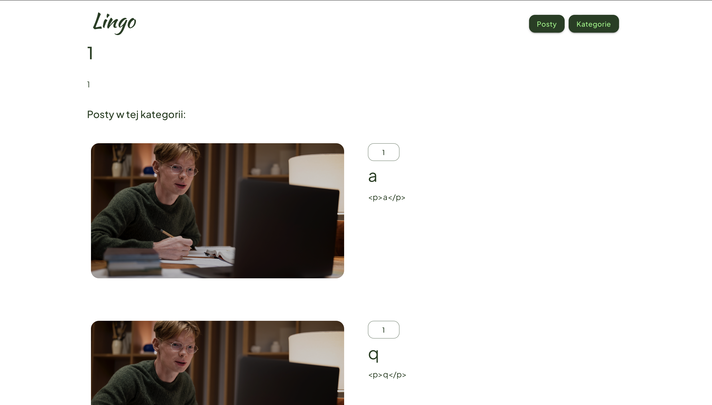
**Category page**

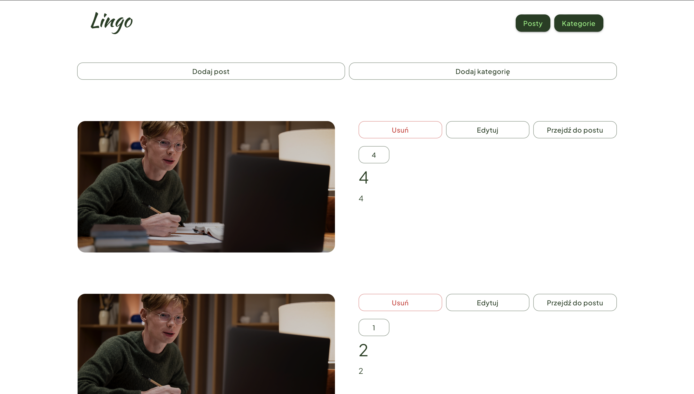
**Posts admin page**

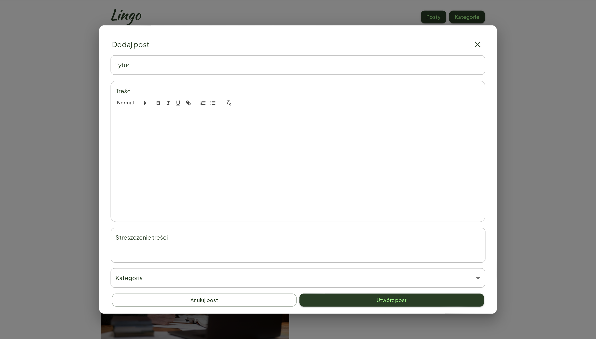
**Add post modal**

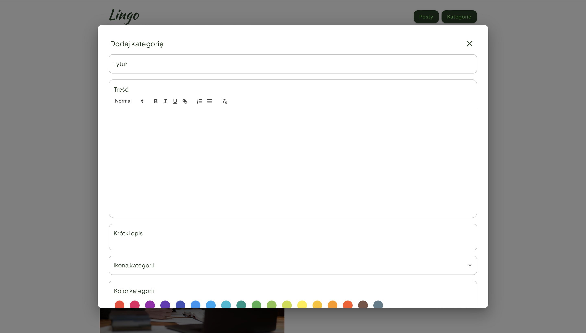
**Add category modal**

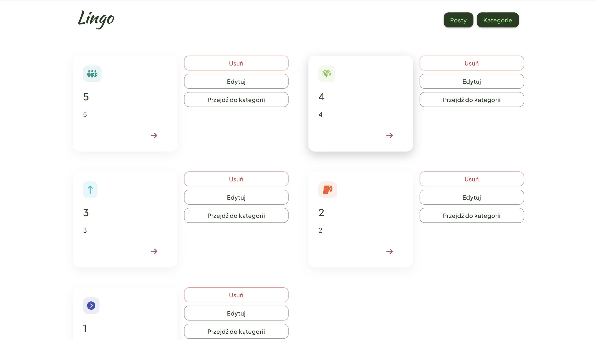
**Category admin page**

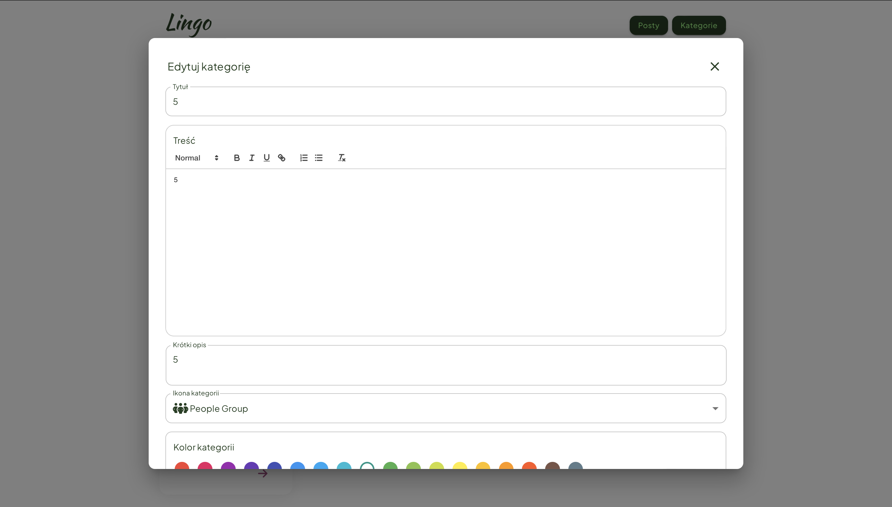
**Edit category modal**

## Setup
In this project, everything required to run and work with this project is included in the **package.json** file

## Usage
To get started with the "Lingo" project, follow these steps:

1. **Clone the repository**: Clone this repository to your computer using the following command:
`git clone https://github.com/twoj-uzytkownik/lingo.git`
2. **Navigate to the project directory**:
`cd lingo`
3. **Install dependencies**: Use the following command to install all the required project dependencies:
`npm install`
4. **Run the project**:
`npm start`
5. **Open your browser** and go to [http://localhost:3000](http://localhost:3000) to use the "Lingo" application.
6. **Customize the project**: You can customize the project by editing components, styles, and adding your own features to meet your needs.
7. **Publish the project**: When you're ready to deploy the project, you can run the build process to create an optimized production-ready version: `npm run build`

The finished project files will be available in the `build` directory.

That's it! You are now ready to start working with the "Lingo" project. Good luck!

## Project Status
Current status of the project: _in progress_

## Room for Improvement
At the moment, some image files need improvement. They do not all have the same extension. The extension of the project logo needs to be changed to a file with the extension .svg. In addition, the frames for the animations contained in the ScrollingSection need to be created in order to provide the right fluidity for them.

Room for improvement:
- Creating a keyframe for animation in ScrollingSection.
- Correction of minor errors.
- Improving the flow of the site.

To do:
- Creation of a panel for the user and for the translator.
- Creation of a login, registration and my account page for users and the translator.
- Posting a fully functional project as a live demo on Vercel or Netlify.
- Implementation of a payment system

## Acknowledgements
Credit is to be given to
- The layout of this project was inspired by [InsightReel](https://www.insightreel.co)

## Contact
Created by [@Łukasz Bajkowski](https://github.com/lukaszbajkowski) - feel free to contact me!

## License
This project is open source and available under the
[MIT License](https://choosealicense.com/licenses/mit/) 